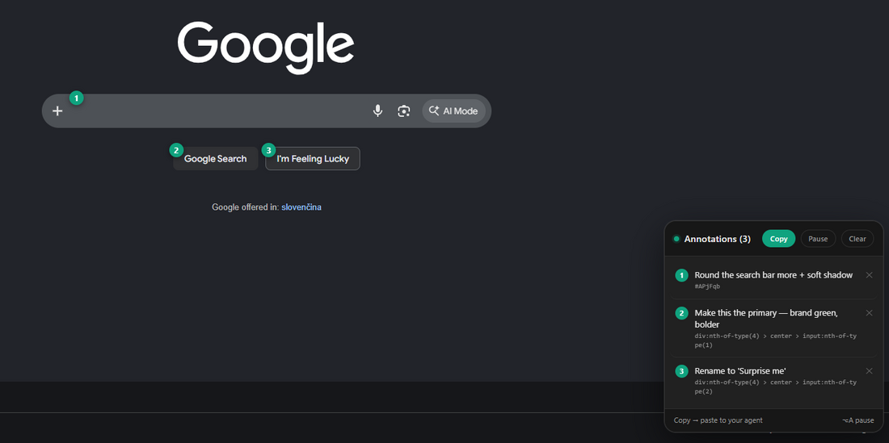

<div align="center">

# browser-annotations

**Click the thing you want changed. Type what's wrong. Paste into your AI coding agent.**

A tiny Chrome extension that turns *"make the button greener, move it left"* into precise notes your
agent can actually act on — with the **exact source file or grep-able anchors** attached.

No account. No server. No data leaves your browser.




</div>

---

## Your agent edits the UI blind. This gives it eyes.

You ask for a change. The agent writes code it can't see. You squint at the browser and type a
paragraph — *"CTA too big, move it left, that's the wrong green."* Slow, lossy, repeat.

**Point at the real UI instead.** Click the element → type the change → **Copy** → paste into your agent.
Every note ships with what pinpoints the code:

- **On a dev build** — the component's **source file + line** (e.g. `src/components/Cart.tsx:48  <CheckoutButton>`),
  read straight off React / Next, Vue, Svelte or Angular.
- **Always** — the element's **opening tag, id, `data-testid`, nearby label and visible text** — the literal
  strings your agent greps. Build-hashed class names are flagged as noise so it doesn't chase them.

So your agent edits the **exact** code, not a guess.

## Install (30 seconds)

Not on the Web Store yet — load it unpacked:

1. Clone or download this repo.
2. Open **`chrome://extensions`** → turn on **Developer mode** (top-right).
3. **Load unpacked** → pick the **`extension/`** folder.
4. Pin **browser-annotations** to your toolbar.

## Use it

1. **Toggle on** — click the toolbar button (or **Alt+Shift+A**). The badge turns ●.
2. **Annotate** — hover → click an element → type the change → **Save**. Repeat.
3. **Copy** — the panel's **Copy** (or **Alt+Shift+C**) → paste into your agent.
4. Toggle off when done. Notes are saved per page in `localStorage` — they come back when you re-enable.

Works on any normal page. (It can't run on `chrome://`, the Web Store, or PDFs — you'll get a red `!` if you try.)

### Shortcuts

| Key | Action |
|---|---|
| **Alt+Shift+A** | toggle the overlay on/off |
| **Alt+Shift+C** | copy all notes as **markdown** |
| **Alt+Shift+J** | copy all notes as **JSON** |
| **Alt+A** | pause/resume capture (clicks pass through while paused) |
| **⌘/Ctrl+Enter** | save the note · **Esc** cancel |

Rebind any of them at `chrome://extensions/shortcuts`.

## What your agent gets

Each note leads with **how to find the element in your code**, then the change and the before-state:

```markdown
App: react (dev build — source file:line per note; grep by data-testid / id / text, ignore hashed classes).

## [#2] make this the primary button — brand green
source: src/components/Cart.tsx:48  <CheckoutButton>
`<button class="btn" data-testid="checkout" type="submit">`  — text: "Place order"
label: "Place your order"
instance: 2 of 3 matching button.btn
dom-path (positional fallback): `main > form > button` · box 180x44 @640,520 · css fontSize:15px fontWeight:600 padding:12px 20px borderRadius:8px
```

- **Dev build?** Your agent opens `src/components/Cart.tsx:48` directly — no searching.
- **Otherwise** it greps `data-testid="checkout"` / `"Place order"` / `btn`, and the **instance** ("2 of 3")
  disambiguates repeated elements.
- The **css** is the before-state for changes like *"make the padding smaller."*

## Built for modern apps

- **Finds your source** — on a dev build it reads the component's file:line off the framework
  (React / Next, Vue, Svelte, Angular) so your agent opens the exact file; otherwise it ranks the grep-able
  anchors (`data-testid` › `id` › visible text) and flags build-hashed class names (CSS-modules,
  styled-components, minified) as noise to ignore.
- **SPA-aware** — re-keys your notes on client-side navigation (`pushState` / `popstate` / `hashchange`),
  so they never vanish or save under the wrong route.
- **CSP-safe** — injected as a content script (vanilla JS, ~29 KB), no inline-eval, no framework, no build step.
- **Minimal permissions** — `activeTab` + `scripting` + `storage`. **No `host_permissions`**, no background
  network, no account. Notes live only in the page's `localStorage`.

## Roadmap

Edit/undo, resilient pin re-locate, action popup, options page, shadow-DOM & same-origin-iframe capture,
Web Store listing, and more — see **[extension/ROADMAP.md](extension/ROADMAP.md)**.

## License

[MIT](LICENSE) © kuzmany
</content>
</invoke>
